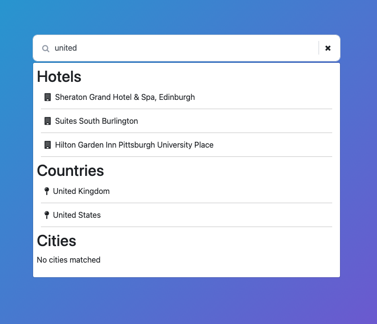

# Accommodation Search

## Technical Coding Test

This project has a simple setup with an api, hooked up to MongoDB and a frontend piece initiated with [vite](https://vitejs.dev/).

## Install and run

From the project root:

```
npm install
```

### Run

Once install has finished, you can use the following to run both the API and UI:

```
npm run start
```

### API

To run the API separately, navigate to the `./packages/api` folder

```
$ cd packages/api
```

And run the `api` server with

```
$ npm run dev
```

The API should start at http://localhost:3001

### Client

To run the `client` server separately, navigate to the `./packages/client` folder

```
$ cd ./packages/client
```

And run the `client` with

```
$ npm run start
```

The UI should start at http://localhost:3000

### Database connection & environment variables

By default, the code is set up to start and seed a MongoDB in-memory server, which should be sufficient for the test. The database URL will be logged on startup, and the seed data can be found at ./packages/api/db/seeds.

If this setup does not work for you or if you prefer to use your own MongoDB server, you can create a .env file. In the ./packages/api folder, create a .env file (or rename the existing .env.sample) and fill in the environment variables.

## Task at hand

When the project is up and running, you should see a search-bar on the screen. This one is currently hooked up to the `/hotels` endpoint.
When you type in a partial string that is part of the name of the hotel, it should appear on the screen.
Ie. type in `resort` and you should see some Hotels where the word `resort` is present.

You will also see 2 headings called **"Countries"** and **"Cities"**.

The assignment is to build a performant way to search for Hotels, Cities or Countries.
Partial searches will be fine. Hotels will need to filterable by location as well.
Ie. The search `uni` should render

- Hotels that are located in the United States, United Kingdom or have the word `uni` in the hotel name.
- Countries that have `uni` in their name Ie. United States, United Kingdom
- No Cities as there is no match

Clicking the close button within the search field should clear out the field and results.

When clicking on one of the `Hotels`, `Cities` or `Countries` links, the application should redirect to the relevant page and render the selected `Hotel`, `City` or `Country` as a heading.



### Write-up

For the "Search Accommodation" task, I created two different Git branches to explore and implement two solutions. The first branch `master` contains a complete solution built with minimal dependencies, focusing on writing code manually rather than relying heavily on libraries. The second branch `update/most-used-libs` is optimized, utilizing popular libraries to enhance performance and efficiency.

#### Branch 1: Minimal Dependencies Approach
- The project is structured as a monorepo, which I found very advantageous. I like to use monorepos in my projects because they simplify code structuring and management. I have extended this monorepo this monorepo setup by adding another workspace folder for libraries. This allow me to create a local npm-like registry for shared code dependencies.
- In the api package, I found that the riginal code was in a single index.ts file. So I refactored it to make it more modular, I separated the code into middlewares, config files, and business logic modules.I Created specific modules (e.g., hotels) with grouped controllers, routes, and validators.
- Im the client package responsible for the frontend, the app's logic was also concentrated in App.tsx. So, I have also refactored its code into separated components, pages, and hooks. And because navigation was required, I installed react-router-dom to handle routing.
-I added unit and integration tests across both frontend and backend. I have also made e2e tests using Playwright because we discussed about it in our last interview.
```bash
# make sure you are in master branch
git checkout master

# install dependencies
npm i

# to run both backend and frontend
npm start

# to run backend test
npm run test:api

# to run front end test
npm run test:client

# to run e2e test
# first make sure the backend is up and running
npm run start:api
# then call
npm run test:e2e
# or call e2e test ui
npm run test:e2e:ui

```
#### Branch 2: Optimized Approach with Enhanced Libraries
- After finishing the implementation of the solution. I considered how the app might be developed for clients or production environments where the search functionality might be heavy.
- On the frontend, I replaced the custom data fetching logic with react-query and axios. This transition allowed us to leverage the built-in features of react-query for handling errors, loading states, and data management more effectively, reducing the need for custom code.
- On the backend, I taught about using a robust search tool and decided to experiment with Elasticsearch, despite being aware that it might be considered overengineering for our use case. Even so this, I wanted to explore its capabilities within the scope of this task. So, I managed to integrate Elasticsearch and have the application up and running with this new setup.
```bash
# make sure you are in update/most-used-libs branch
git checkout update/most-used-libs

# install dependencies
npm i

# make sure the elasticsearch server is all the time running
docker compose up

# clear elasticsearch from existing data (useful whwn using mongodeb-memory-server)
npm run es:clear 

# start the app, this will also seed the data in the mongodeb-memory-server
npm start

# before using the app make sure that the same data in mongodb will be in elasticsearch
npm run es:setup 

# backend test
npm run test:api # its better to clear elastic search from data before test by calling `npm run es:clear`

# to run front end test
npm run test:client

# to run e2e test
# first make sure the backend is up and running
npm run start:api
# then call
npm run test:e2e
# or call e2e test ui
npm run test:e2e:ui
```
#### conlusions
*What I've Achieved:*
- Search Functionality: The app now has a functional search feature that can search across various collections (hotels, countries, cities).
- Error Handling: Implemented error handling throughout the app. The app gracefully handles errors and provides meaningful feedback to the user.
- Navigation: Improved navigation with smooth transitions between pages. The app uses react-router-dom for managing routes effectively.
- Redirection After Errors: The app has a mecanisme to redirect users to the home page in cases of errors or when a "Not Found" status is encountered, ensuring a better user experience.

*what I want to do later:*
- Pagination:I think that the way how search result is diplayed should be reconsiderd, if we analyse how the data is retrieved.
- Look into other options than elasticsearch: look for a solution that is maybe more adequate to small apps, I think that indexing in our app is far enough, but we might think about also caching mechanism to store frequently accessed data and search results
- Dockerization: I wanted to Dockerize the entire app when using elasticsearch but I had some issues that need just some time and focus , so they can be fixed.
### Database structure

#### Hotels Collection

```json
[
  {
    "chain_name": "Samed Resorts Group",
    "hotel_name": "Sai Kaew Beach Resort",
    "addressline1": "8/1 Moo 4 Tumbon Phe Muang",
    "addressline2": "",
    "zipcode": "21160",
    "city": "Koh Samet",
    "state": "Rayong",
    "country": "Thailand",
    "countryisocode": "TH",
    "star_rating": 4
  },
  {
    /* ... */
  }
]
```

#### Cities Collection

```json
[
  { "name": "Auckland" },
  {
    /* ... */
  }
]
```

#### Countries Collection

```json
[
  {
    "country": "Belgium",
    "countryisocode": "BE"
  },
  {
    /* ... */
  }
]
```
